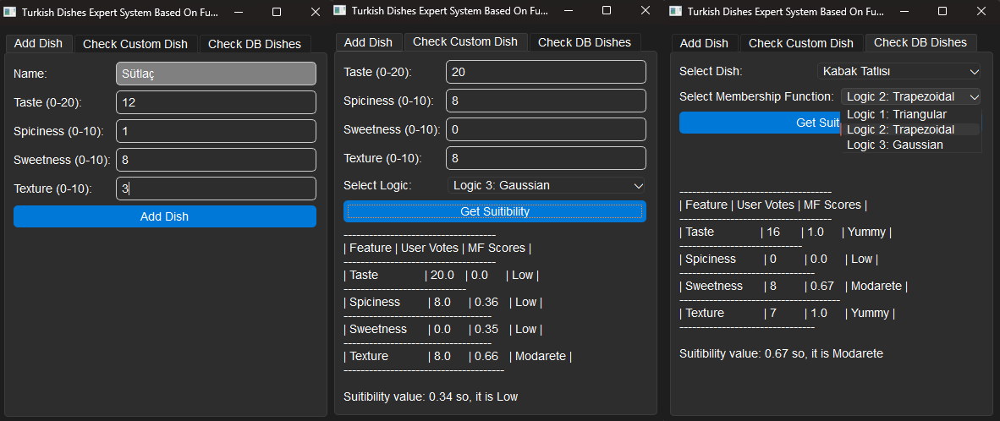

## 🧠 Why Fuzzy Logic? / Neden Bulanık Mantık?

In real life, concepts like "tasty", "spicy", or "sweet" are subjective and don't have strict boundaries. A food that is too spicy for one person might be mild for another. Fuzzy Logic allows us to evaluate such vagueness by assigning gradual scores instead of binary decisions (like yes/no or good/bad). It models human reasoning by allowing partial membership in different categories.

This project uses fuzzy logic to evaluate food characteristics — **taste**, **spiciness**, **sweetness**, and **texture** — with different membership functions and logic types. The final output provides a human-readable evaluation of how "suitable" or "delicious" a food might be.

<details>
<summary>Türkçe</summary>
Gerçek hayatta "lezzetli", "acı", "tatlı" gibi kavramlar kişiden kişiye değişen, kesin sınırları olmayan ifadelerdir. Bir kişi için fazla acı olan bir yemek, başka biri için normal olabilir. Bulanık mantık (Fuzzy Logic), bu tür belirsizlikleri değerlendirmek için doğrusal olmayan ama dereceli bir yaklaşım sunar. Evet/Hayır gibi ikili kararlardan ziyade, değerleri bir aralıkta derecelendirerek insan mantığını taklit eder.

Bu proje, **tat**, **acılık**, **tatlılık** ve **doku** gibi yemek özelliklerini farklı üyelik fonksiyonları ve mantık türleriyle değerlendirerek, yiyeceklerin ne kadar "uygun" veya "lezzetli" olduğuna dair yorum yapar.

</details>

---

### 🧪 Membership Functions Used / Kullanılan Üyelik Fonksiyonları

<details>

To evaluate food features fuzzily, the project uses three types of **membership functions (MF)**. Each MF determines how much a feature belongs to the concept of "good" or "suitable" within a given range.

<details>
<summary>Türkçe</summary>
Bu projede yiyeceklerin derecelendirilmesi için 3 tür üyelik fonksiyonu (Membership Function) kullanılır. Her biri, verilen bir değerin "iyi" ya da "uygun" kavramına ne ölçüde ait olduğunu belirler.
</details>

---

#### 🔺 1. Triangular Membership Function

- **Shape**: A triangle with a peak in the middle.
- **Behavior**: Maximum score at the center (b), and decreasing linearly toward the edges (a and c).
- **Used when**: A sharp preference peak is expected (e.g., ideal taste level).
<details>
<summary>Türkçe</summary>
🔺 1. Üçgensel Üyelik Fonksiyonu

- **Şekil**: Ortası en yüksek olan üçgen.
- **Davranış**: En yüksek puan merkezde (b), kenarlara doğru düşer (a ve c).
- **Kullanım**: Keskin bir tercih varsa (örneğin ideal tat seviyesi).

**Örnek (Tat)**: triangular_mf(value, 5, 10, 20)

10 noktasında maksimum, 5’in altında ve 20’nin üstünde sıfır puan.

</details>

```python
triangular_mf(x, a, b, c)
```

Example (Taste): triangular_mf(value, 5, 10, 20)

Max score at 10, zero below 5 or above 20.

---

#### 🔷 2. Trapezoidal Membership Function

- **Shape**: Trapezoid with a plateau (flat top).
- **Behavior**: Full membership between b and c; gradual increase from a to b and decrease from c to d.
- **Used when**: A broader range of values is considered equally good.

<details>
<summary>Türkçe</summary>
🔷  2. Yamuksal Üyelik Fonksiyonu

- **Şekil**: Üstü düz olan bir yamuk.
- **Davranış**: b ile c arası tam üyelik; a-b ve c-d arasında kademeli artış/azalış.
- **Kullanım**: Geniş bir aralık "iyi" kabul ediliyorsa uygundur.

**Örnek (Acılık)**: trapezoidal_mf(value, 0, 1, 6, 10)

1 ile 6 arası tam puan, 6'dan sonra düşer.

</details>

```python
trapezoidal_mf(x, a, b, c, d)
```

Example (Spiciness): trapezoidal_mf(value, 0, 1, 6, 10)

Full score from 1 to 6, decreases after 6.

---

#### 🔵 3. Gaussian Membership Function

- **Shape**: Bell curve (like a normal distribution).
- **Behavior**: Highest membership at the mean, decreasing smoothly on both sides.
- **Used when**: Soft transitions and uncertainty around the center are expected.

<details>
<summary>Türkçe</summary>
🔵 3. Gauss Üyelik Fonksiyonu

- **Şekil**: Normal dağılım eğrisi (çan eğrisi).
- **Davranış**: Ortalamada en yüksek üyelik, her iki yana doğru yumuşak azalış.
- **Kullanım**: Merkez etrafında belirsizlik varsa uygundur.

**Örnek (Acılık)**: gaussian_mf(value, 5.5, 3.8)

5.5'te maksimum, iki tarafta yumuşakça düşer.

</details>

```python
gaussian_mf(x, mean, sigma)
```

Example (Sweetness): gaussian_mf(value, 5.5, 3.8)

Peak at 5.5, smooth fade on both sides.

---

</details>

---

## 📊 Evaluation Parameters / Değerlendirme Parametreleri

Each feature has a different acceptable range:
These values are either entered manually or read from a dataset (Excel/CSV).



| Feature / Özellik    | Range / Aralık |
| -------------------- | -------------- |
| Taste / Tat          | 0 – 20         |
| Spiciness / Acılık   | 0 – 10         |
| Sweetness / Tatlılık | 0 – 10         |
| Texture / Doku       | 0 – 10         |

---

## 🖥️ How to Use the Application / Uygulama Nasıl Kullanılır?

This GUI has **three main tabs**:

### 🔹 1. Add Dish

Use this tab to manually **enter a new food** and its characteristics.

#### 📋 What to Fill:

- **Name**: Name of the dish (e.g., Sütlaç)
- **Taste** (0-20): Overall taste rating
- **Spiciness** (0-10): How spicy the dish is
- **Sweetness** (0-10): Sweetness level
- **Texture** (0-10): Mouthfeel, crunchiness or softness

Click **"Add Dish"** to save it to the internal database.

<details>
<summary>Türkçe</summary>

### 🔹 1. Yemek Ekle

Bu sekmede yeni bir yemek ve özelliklerini **manuel olarak girebilirsiniz.**

#### 📋 Doldurulacak Alanlar:

- **İsim**: Yemeğin adı (örneğin Sütlaç)
- **Tat (0-20)**: Genel lezzet puanı
- **Acılık (0-10)**: Yemeğin ne kadar acı olduğu
- **Tatlılık (0-10)**: Tatlılık düzeyi
- **Doku (0-10)**: Ağızda bıraktığı his, yumuşaklık/sertlik

**"Add Dish"** butonuna basarak yemeği veritabanına eklersiniz.

</details>

---

### 🔹 2. Check Custom Dish

This tab is used to **manually test a dish** that’s not saved in the database.

#### 🧪 What to Do:

- Enter values for Taste, Spiciness, Sweetness, and Texture.
- Choose one of the three **Fuzzy Logic methods**:
  - Logic 1: Triangular
  - Logic 2: Trapezoidal
  - Logic 3: Gaussian
- Click **"Get Suitibility"** to get the evaluation.

It shows:

- Your input values
- Corresponding fuzzy membership scores
- A final **suitability score and label** (e.g., "Low", "Moderate", "Yummy")

<details>
<summary>Türkçe</summary>

### 🔹 2. Özel Yemek Değerlendir

Bu sekmede **veritabanında olmayan bir yemeği manuel olarak test edebilirsiniz.**

#### 🧪 Yapılacaklar:

- Tat, Acılık, Tatlılık ve Doku değerlerini girin.
- Üç bulanık mantık yönteminden birini seçin:
  - Logic 1: Üçgensel
  - Logic 2: Yamuksal
  - Logic 3: Gauss
- **"Get Suitibility"** butonuna tıklayarak değerlendirme alın.

Size şunları gösterir:

- Girdiğiniz değerler
- Karşılık gelen üyelik (MF) skorları
- Sonuç olarak **uygunluk puanı ve etiketi** ("Low", "Moderate", "Yummy" gibi)

</details>

---

### 🔹 3. Check DB Dishes

This tab lets you evaluate a **dish already stored** in the database.

#### 📦 What to Do:

- Select a **dish** from the dropdown.
- Choose a **membership function** (Triangular, Trapezoidal, Gaussian).
- Click **"Get Suitibility"** to evaluate the food.

It retrieves the saved values, applies fuzzy logic, and shows:

- Individual MF scores for each feature
- Overall suitability score and its meaning

<details>
<summary>Türkçe</summary>

### 🔹 3. Kayıtlı Yemekleri Değerlendir

Bu sekmede **veritabanında daha önce kaydedilmiş** bir yemeği değerlendirebilirsiniz.

#### 📦 Yapılacaklar:

- Açılır menüden bir **yemek seçin.**
- Bir **üyelik fonksiyonu** seçin (Üçgensel, Yamuksal, Gauss).
- **"Get Suitibility"** butonuna tıklayın.

Sistem:

- Kayıtlı değerleri alır
- Seçilen bulanık mantık yöntemiyle değerlendirir
- Özelliklere ait üyelik skorlarını ve genel uygunluk sonucunu gösterir

</details>

### 🖥️ For End Users (No Python Required)

If you just want to use the application without setting up the source code, download the .exe file below:

👉 [Download form_ui.exe](https://github.com/iskburcin/Turkish-Dishes-Expert-System-Based-On-Fuzzy-Reasoning/releases/tag/v1.0.0)
Just double-click the file to run the app!

### 👩‍💻 For Developers

If you want to explore or modify the source code:

```bash
git clone https://github.com/iskburcin/Turkish-Dishes-Expert-System-Based-On-Fuzzy-Reasoning.git
cd ../3.EvaluateTheSuitabilityOfDishesBasedOnFuzzyReasoning
pip install -r requirements.txt
python form_ui.py
```

To build the .exe yourself using PyInstaller:

```bash
pyinstaller form_ui.spec
```
